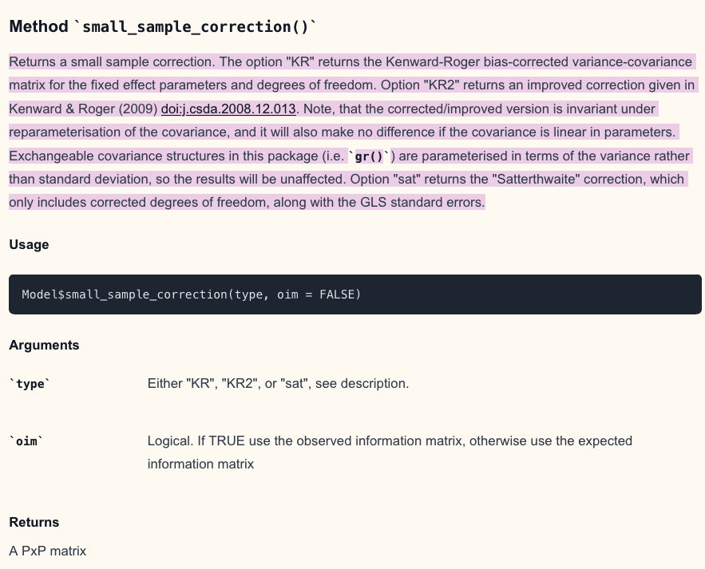

```{r setup, include=FALSE}
knitr::opts_chunk$set(echo = TRUE, cache=F)

library(DHARMa)
library(here)
library(tidyverse)
library(cowplot); library(patchwork)
theme_set(theme_cowplot() + 
            theme(panel.background = element_rect(color = "black")))

# plot Colors
source(here("code_results", "plotColors.R"))
```

# Explanations

**package: glmmrBase** <https://cran.r-project.org/web/packages/glmmrBase/index.html>

**website (out of date)**: <https://samuel-watson.github.io/glmmr-web/>

**preprint about the package (2024)**: <https://arxiv.org/abs/2303.12657>

**mantainer**: Samuel Watson - Prof stats Uni Birmingham <https://www.birmingham.ac.uk/staff/profiles/applied-health/watson-sam>

To create the Pearson Chi-squared test with the approximate residual degrees of freedom, I first:

-   converted the lme4 function to the glmmrBase function\
-   and used the method small-sample_correction() to have the dfs correction:
    -   Kenward-Roger\
    -   Kenward-Roger2\
    -   Satterthwaithe\
-   I subtracted the sample size from this df to have the residual df.\
-   I used two.sides test.

From [Watson 2024](https://arxiv.org/abs/2303.12657): “The degrees of freedom correction is also given in Kenward and Roger (1997), which is the same degrees of freedom correction originally proposed by Satterthwaite (1946). The Kenward-Roger correction, though, can over-estimate the standard errors in very small samples in some cases. Kenward and Roger (2009) proposed an improved correction for covariance functions not linear in parameters (such as the autoregressive or exponential functions). The improved correction adds an additional adjustment factor. We have implemented these corrections in the package, which can returned directly from a Model object using the small_sample_correction() member function” 



The function:
```         
approximateDFpearson <- function(model, data, type=c("naive", "KR", "KR2", "sat"),
                              alternative=c("two.sided", "greater", "less")){
  
  if(class(model)[1] != "glmerMod") stop("model is not a glmerMod from lme4")
  if(model@resp$family$family != "poisson") stop("model is not a Poisson")
  
  if(type == "naive"){
    rdf <- df.residual(model) 
    } else{
    f1 <- glmmrBase::lme4_to_glmmr(formula(model), colnames(data))
    mod <- glmmrBase::Model$new(f1, data=data, family=poisson())
    rdf <- dim(data)[1]- mod$small_sample_correction(type)$dof[1]
    }
  
  rp <- residuals(model, "pearson")
  Pearson.chisq <- sum(rp^2)
  prat <- Pearson.chisq/rdf
  
  if(alternative == "greater") pval <- pchisq(Pearson.chisq, df=rdf, lower.tail=FALSE)
  else if (alternative == "less") pval <- pchisq(Pearson.chisq, df=rdf, lower.tail=TRUE)
  else if (alternative == "two.sided") pval <- min(min(pchisq(Pearson.chisq, df=rdf, lower.tail=TRUE), pchisq(Pearson.chisq, df=rdf, lower.tail=FALSE)) * 2,1)
  
  out = list()
  out$statistic = prat
  names(out$statistic) = "dispersion"
  out$parameter = rdf
  names(out$parameter) = paste0("df-",type) 
  out$method = "Parametric dispersion test via mean Pearson-chisq statistic"
  out$alternative = alternative
  out$p.value = pval
  class(out) = "htest"
  return(out)
}
```

```{r}
source(here("code_sim", "0_approximateDFpearson.R"))
```

# Loading simulation outputs

Simulations done in `8_glmm_approxiDFpearson.R`:

Sim setting:
```{r, eval=F}
sampleSize <- c(200, 500, 1000)
intercept <- c(-1.5,0,1.5)
overdispersion = seq(0,1,0.1)
ngroups <-  c(10, 50, 100)
nRep = 1000
slope = 1
randomEffectVariance = 1
```

```{r}
load(here("data", "8_approximateDFpearson.Rdata")) # simulated data
(tspent <- map_dbl(out.pois, "time")) # minutes
```


```{r}
#simulations
simuls.pois <- map_dfr(out.pois, "simulations", .id="model") %>%
  separate(model, c("ngroups", "sampleSize", "intercept"), sep="_") %>%
  rename(overdispersion = controlValues,
        PearNaive.rdf = PearNaive.rdf.df.naive,
        PearSat.rdf = PearSat.rdf.df.sat,
        PearKR.rdf = PearKR.rdf.df.KR,
        PearKR2.rdf = PearKR2.rdf.df.KR2)
```


There were many negative residual dfs, it generates NaN to the test:

```{r}
simuls.nan <- simuls.pois %>% filter(PearSat.rdf < 0 |
                                     PearKR.rdf  < 0 |
                                     PearKR2.rdf < 0)
```

It was around `r round(dim(simuls.nan)[1]*100/ dim(simuls.pois)[1])`% of the simulations.

Almost everything came from the 100 groups in 200 sample sizes - 2 observations per group:

```{r}
table(simuls.nan$ngroups, simuls.nan$sampleSize)
```

The percentage of failure was around the same among the corrections
```{r}
sum(simuls.nan$PearSat.rdf <0) / dim(simuls.pois)[1]
sum(simuls.nan$PearKR.rdf <0) / dim(simuls.pois)[1]
sum(simuls.nan$PearKR2.rdf <0) / dim(simuls.pois)[1]
```

Subsetting the simulation output only for the positive rdfs:

```{r}
simuls.pois2 <- simuls.pois %>% filter(PearSat.rdf > 0 &
                                                       PearKR.rdf >0  &
                                                       PearKR2.rdf >0)
```

# Comparing corrections of residual df

```{r}
dof <- simuls.pois2 %>% dplyr::select(contains("rdf"), replicate, ngroups,
                                        overdispersion, intercept, sampleSize) %>%
  pivot_longer(1:4, names_to = "test", values_to = "res.df") %>%
  group_by(sampleSize, ngroups, intercept,overdispersion, test) 
dof$intercept <- fct_relevel(dof$intercept, "-1.5", "0", "1.5")
dof$ngroups <- fct_relevel(dof$ngroups, "10", "50", "100")
dof$sampleSize <- as.factor(as.numeric(dof$sampleSize))
```

Very similar rdfs. Satterthwaite had a bit smaller rdfs for small sample size.
```{r, echo=F}
dof %>% ungroup() %>% mutate(test = fct_relevel(test, "PearNaive.rdf", "PearKR.rdf", 
                                  "PearKR2.rdf", "PearSat.rdf")) %>%
ggplot(aes(x=ngroups, y=res.df, col=test)) +
  geom_boxplot()+
  facet_wrap(~sampleSize, scales="free",
            labeller = as_labeller(c("200"= "n = 200", 
                                    "500" = "n = 500", 
                                    "1000" = "n = 1000"))) +
  ylab("Residual degrees of freedom")+
  xlab("Number of groups in random intercept") +
  scale_color_discrete(labels = c("Naïve", "KR", "KR2", "Satt"))+
  theme(legend.position = "bottom") 
ggsave(here("figures", "8_glmm_approxDF_df.jpeg"), height = 5, width=10)
```

# Type I error

```{r}
p.pois <- simuls.pois2 %>% dplyr::select(ends_with(".p"), replicate,
                                        ngroups,
                                        overdispersion, intercept, sampleSize) %>%
  pivot_longer(1:4, names_to = "test", values_to = "p.val") %>%
  group_by(sampleSize, ngroups, intercept, overdispersion, test) %>%
  summarise(p.sig = sum(p.val<0.05,na.rm=T),
            nsim = length(p.val[!is.na(p.val)]))
p.pois$prop.sig <- p.pois$p.sig/p.pois$nsim
p.pois$intercept <- fct_relevel(p.pois$intercept, "-1.5", "0", "1.5")
p.pois$ngroups <- fct_relevel(p.pois$ngroups, "10", "50", "100")
p.pois$sampleSize <- as.factor(as.numeric(p.pois$sampleSize))
```


```{r,echo=F, fig.height=6, fig.width=8}
p.pois %>% filter(overdispersion == 0) %>% ungroup() %>%
  mutate(ngroups = fct_relevel(ngroups, "10", "50", "100"),
         test = fct_relevel(test, "PearNaive.p", "PearSat.p", "PearKR.p",
                            "PearKR2.p")) %>%
  ggplot(aes(x=sampleSize, y=prop.sig, col=intercept))+
  geom_point( position = position_dodge(width = 0.3))+
  geom_hline(yintercept = 0.05, linetype="dotted")+
  geom_line(aes(x=as.numeric(sampleSize)),
            position = position_dodge(width = 0.3))+
  facet_grid(ngroups~test,
             labeller = as_labeller(c("PearNaive.p" = "Naïve",
                                      "PearSat.p" = "Sat", 
                                      "PearKR.p" = "KR",
                                      "PearKR2.p" = "KR2",
                                      "10" = "m = 10", 
                                      "50" = "m = 50",
                                      "100" = "m = 100")))+
  theme(panel.background = element_rect(color="black"),
        axis.text.x = element_text(angle=45, hjust=1),
        legend.position = "inside",
        legend.text = element_text(size=10),
        legend.title = element_text(size=10),
        legend.background = element_rect(color="gray95", fill="gray95"),
        legend.position.inside =   c(0.01,0.12)) +
xlab("Sample Size") + ylab( "Type I error")
ggsave(here("figures", "8_glmm_approxDF_type1.jpeg"), width=10, height = 6)
```

# Power

```{r,echo=F, fig.height=10, fig.width=10}
p.pois %>%
  ggplot(aes(x=overdispersion, y=prop.sig, col=test, linetype=ngroups, shape=ngroups))+
  geom_point(alpha=0.7) + geom_line(alpha=0.7) +
  facet_grid(sampleSize~intercept) +
  geom_hline(yintercept = c(0.05,0.5), linetype="dotted") +
  ylim(0,1)+
  ggtitle("Poisson", subtitle = "1000 sim") +
  theme(panel.background = element_rect(color="black"),
        legend.position = "bottom") + 
  guides(color=guide_legend(nrow=2, byrow=TRUE))
ggsave(here("figures", "8_glmm_approxDF_power.jpeg"), width=12, height = 12)
```


- Power for the 3 correction methods is basically the same. 
- Corrected power still very bad for small intercepts (-1.5 and 0), 


figure for each N groups separated
```{r,echo=F, fig.height=8}
p.pois %>% filter(ngroups == "10") %>%
  ggplot(aes(x=overdispersion, y=prop.sig, col=test, linetype=ngroups, shape=ngroups))+
  geom_point(alpha=0.7) + geom_line(alpha=0.7) +
  facet_grid(sampleSize~intercept) +
  geom_hline(yintercept = c(0.05,0.5), linetype="dotted") +
  ylim(0,1)+
  ggtitle("Poisson", subtitle = "1000 sim") +
  theme(panel.background = element_rect(color="black"),
        legend.position = "bottom") + 
  guides(color=guide_legend(nrow=2, byrow=TRUE))
```


```{r,echo=F, fig.height=8}
p.pois %>% filter(ngroups == "50") %>%
  ggplot(aes(x=overdispersion, y=prop.sig, col=test, linetype=ngroups, shape=ngroups))+
  geom_point(alpha=0.7) + geom_line(alpha=0.7) +
  facet_grid(sampleSize~intercept) +
  geom_hline(yintercept = c(0.05,0.5), linetype="dotted") +
  ylim(0,1)+
  ggtitle("Poisson", subtitle = "1000 sim") +
  theme(panel.background = element_rect(color="black"),
        legend.position = "bottom") + 
  guides(color=guide_legend(nrow=2, byrow=TRUE))
```


```{r,echo=F, fig.height=8}
p.pois %>% filter(ngroups == "100") %>%
  ggplot(aes(x=overdispersion, y=prop.sig, col=test, linetype=ngroups, shape=ngroups))+
  geom_point(alpha=0.7) + geom_line(alpha=0.7) +
  facet_grid(sampleSize~intercept) +
  geom_hline(yintercept = c(0.05,0.5), linetype="dotted") +
  ylim(0,1)+
  ggtitle("Poisson", subtitle = "1000 sim") +
  theme(panel.background = element_rect(color="black"),
        legend.position = "bottom") + 
  guides(color=guide_legend(nrow=2, byrow=TRUE))
```


# Dispersion statistics

Median of disp stat
```{r}
d.pois <- simuls.pois2 %>% dplyr::select(ends_with("dispersion"), replicate, ngroups,
                                        overdispersion, intercept, sampleSize) %>%
  pivot_longer(1:4, names_to = "test", values_to = "dispersion") %>%
  group_by(sampleSize, ngroups, intercept,overdispersion, test) %>%
  summarise(median.stat = median(dispersion, na.rm=T))
d.pois$intercept <- fct_relevel(d.pois$intercept, "-1.5", "0", "1.5")
d.pois$ngroups <- fct_relevel(d.pois$ngroups, "10", "50", "100")
d.pois$sampleSize <- as.factor(as.numeric(d.pois$sampleSize))
```


```{r,echo=F, fig.height=8, fig.width=8}
d.pois %>% filter(test != "Pear.stat.dispersion") %>%
  ggplot( aes(x=overdispersion, y=median.stat, col=test, linetype=ngroups, shape=ngroups))+
  geom_point(alpha=0.7) + geom_line(alpha=0.7) +
  scale_y_log10()+
  facet_grid(sampleSize~intercept, scales="free") +
  annotate("rect", xmin = 0, xmax = 1, ymin = 0.5, ymax = 1,
           alpha = .1,fill = "red")+
  geom_hline(yintercept = 1, linetype="dotted", col="gray")+
  ggtitle("Poisson: dispersion statistics", subtitle = "100 sim") +
  theme(panel.background = element_rect(color="black"),
        legend.position = "bottom") + 
  guides(color=guide_legend(nrow=2, byrow=TRUE))
#ggsave(here("figures", "5_glmmPois_dispersionStatsALL.jpeg"), width=12, height = 15)
```


Simplified figure with just one correction (KR2) to compare with the Naïve
```{r,echo=F, fig.height=8, fig.width=8}
d.pois %>% filter(test %in% c("PearNaive.statistic.dispersion",
                              "PearKR2.statistic.dispersion"),
                  ngroups %in% c("50", "100")) %>%
  ggplot( aes(x=overdispersion, y=median.stat, col=test, linetype=ngroups, shape=ngroups))+
  geom_point(alpha=0.7) + geom_line(alpha=0.7) +
  scale_y_log10()+
  facet_grid(sampleSize~intercept, scales="free") +
  annotate("rect", xmin = 0, xmax = 1, ymin = 0.5, ymax = 1,
           alpha = .1,fill = "red")+
  geom_hline(yintercept = 1, linetype="dotted", col="gray")+
  xlab( "Overdispersion") + ylab("Dispersion parameter (median)")+
  theme(panel.background = element_rect(color="black"),
        legend.position = "bottom") + 
  guides(color=guide_legend(nrow=2, byrow=TRUE),
         linetype=guide_legend(nrow=2, byrow=TRUE),
         shape=guide_legend(nrow=2, byrow=TRUE)) +
  scale_color_discrete("Test",labels = c("KR2", "Naïve")) +
  scale_linetype("Number of groups") +
  scale_shape("Number of groups")
ggsave(here("figures", "8_glmm_approxDF_dispersion.jpeg"), width=8, height = 7)
```


# Compare power with the other tests

Compare pearson corrections with Dharma-conditional and pearson par boot.

Using only ONE correction, 100 groups

```{r}
load(here("data", "5_glmmPois_power_50.Rdata")) # simulated data
out.pois50 <- out.pois
load(here("data", "5_glmmPois_power_100.Rdata")) # simulated data
out.pois100 <- out.pois

out.pois <- flatten(list(out.pois50, out.pois100))

simuls.pois <- map_dfr(out.pois, "simulations", .id="model") %>%
  separate(model, c("ngroups", "sampleSize", "intercept"), sep="_") %>%
  rename("overdispersion" = "controlValues")

# power
pw <- simuls.pois %>% dplyr::select(dhaCO.p.val,refCO.p.val, replicate,
                                      ngroups,
                                      overdispersion, intercept, sampleSize) %>%
  filter(intercept %in% c( "-1.5", "0", "1.5"),
         sampleSize %in% c("200", "500", "1000")) %>%
  pivot_longer(1:2, names_to = "test", values_to = "p.val") %>%
  group_by(sampleSize, ngroups, intercept, overdispersion, test) %>%
  summarise(p.sig = sum(p.val<0.05,na.rm=T),
            nsim = length(p.val[!is.na(p.val)]))
pw$prop.sig <- pw$p.sig/pw$nsim
pw$intercept <- fct_relevel(pw$intercept, "-1.5", "0", "1.5")
pw$sampleSize <- as.factor(as.numeric(pw$sampleSize))
```


```{r, fig.height=8}
comb <- p.pois %>% filter(ngroups %in% c("50", "100"), test == "PearKR2.p") %>%
  bind_rows(pw)
  
ggplot(comb, aes(x=overdispersion, y=prop.sig, col=test, linetype=ngroups, shape=ngroups))+
  geom_point(alpha=0.7) + geom_line(alpha=0.7) +
  facet_grid(sampleSize~intercept) +
  geom_hline(yintercept = c(0.05,0.5), linetype="dotted") +
  ylim(0,1)+
  theme(panel.background = element_rect(color="black"),
        legend.position = "bottom") + 
  guides(color=guide_legend(nrow=3, byrow=TRUE),
         linetype=guide_legend(nrow=2, byrow=TRUE),
         shape=guide_legend(nrow=2, byrow=TRUE)) +
  xlab("Overdispersion") + ylab("Power")+
  scale_color_discrete(labels = c("conditional sim-based variance", 
                                   "Pearson Chi-sq KR2", 
                                   "nonparam. Pearson residuals"))
ggsave(here("figures", "8_glmm_approxDF_power2.jpeg"), width=8, height = 8)
```


