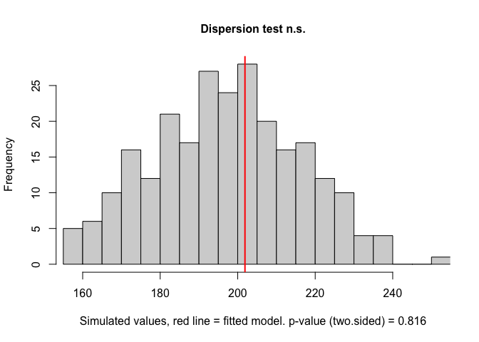
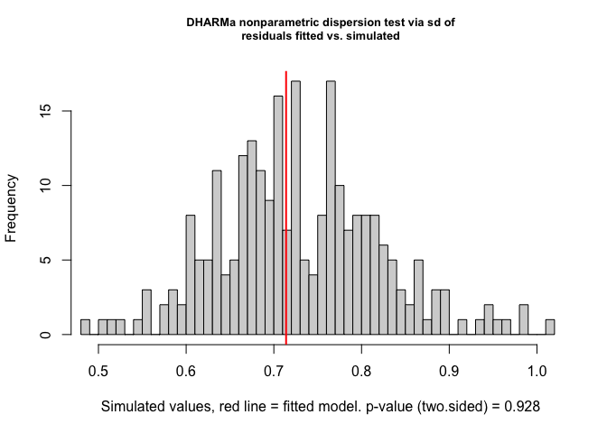
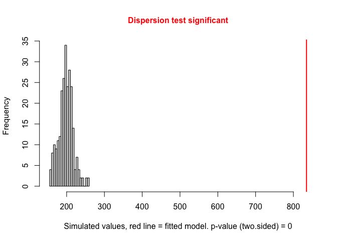
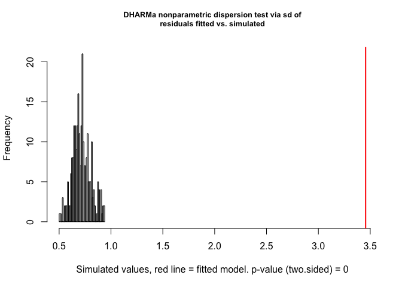
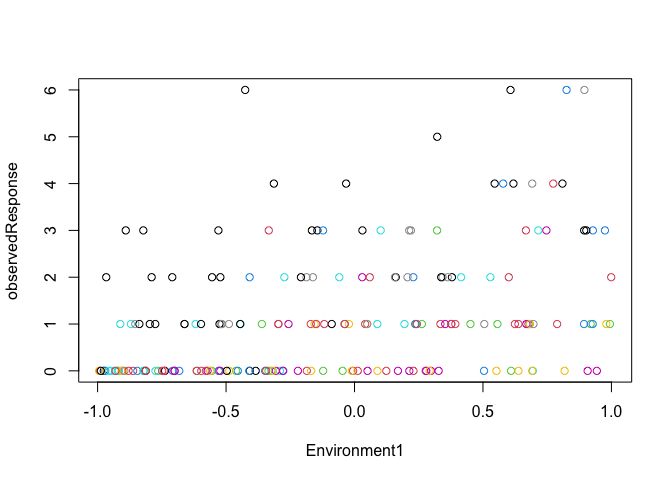
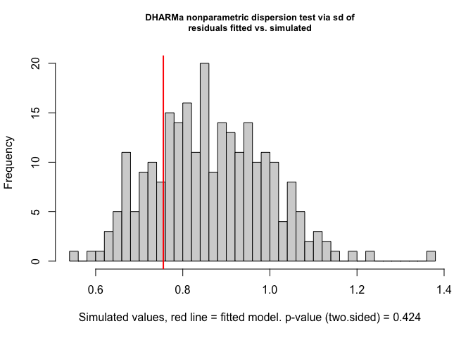
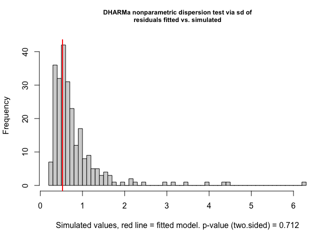
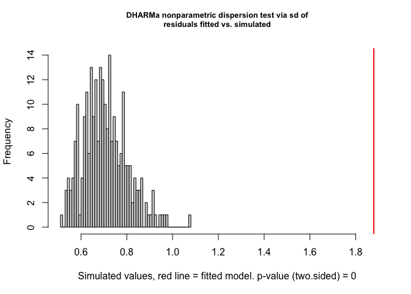
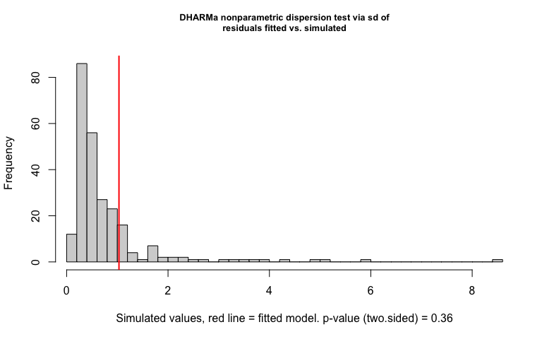

Acompanying example script from "Dispersion tests for generalized linear mixed-effects models".

Our aim is to give some instructions and show examples for testing for under/overdispersion for GLMs (base R functions `glm`) and GLMMs (package `lme4`) using the `DHARMa` package.

Users can substitute the simulated data and model by their own data and model objects[^1] to use the dispersion test function from the `DHARMa` package.

[^1]: Please verify the currently supported modeling packages in DHARMa.

Loading used packages:


``` r
library(DHARMa) # dispersion test and other models' diagnostic
library(lme4) # for GLMMs

set.seed(2025) # for reproducible examples
```

# Dispersion tests in `DHARMa`

Dispersion tests in `DHARMa` are performed using the function `testDispersion`. You can test for:

- Both under- or overdispersion with the argument `alternative = "two.sided"` (two sided test).

- Underdispersion only with `alternative = "less"`.

- Overdispersion only with `alternative = "greater"`.

### Parametric Pearson residuals test

The parametric Pearson residuals test is peformed when using the argument `type = "PearsonChisq`, when providing the model object in the first argument position (`simulationOutput`), for example:


``` r
testDispersion(model, type = "PearsonChisq") # substitute "model" by your model object name
```

Note that **parametric Perason Pearson residuals test is biased for GLMMs towards underdispersion** (more details in the main study). Tests with `alternative = "two.sided"` or `alternative = "less"` are therefore not reliable. If you have random effects in your model, we recommend to test only for overdispersion with `alternative = 'greater'`.


### Nonparametric Pearson residuals test

For the nonparametric Pearson residuals test, it is necessary a first step in generating simulations from the model using the function `simulateResiduals` with the argument `refit = TRUE`. This way, the function will record the Pearson residuals from the simulated data from parametric bootstrapping. 
Afterwards, use the resulting object in `testDispersion` with `type = "DHARMa"`:


``` r
res <- simulateResiduals(model, refit = T) 
testDispersion(res, type = "DHARMa")
```

The number of simulations is set in `simulateResiduals()` with the argument `n`, which is by default 250. If your model is complex and the computational time is too long for the parametric bootstrapping, we recommend you to decrease the number of simulations (however, don't go lower than 100), or use the simulation-based response variance test explained below.


### Simulation-based response variance test

The simulation-based response variance test is available through the same functions as before, but for `simulateResiduals()` with argument `refit = F` (the default of the function):


``` r
res <- simulateResiduals(model, refit = F)
testDispersion(res, type = "DHARMa")
```

For **GLMMs**, the options for simulating results **conditionally on the random effects** is currently available only for models fitted with the `lme4` package by using the argument `re.form = NULL`, which is passed to the function `simulate.merMod()` in `lme4`:


``` r
res <- simulateResiduals(modelGLMM, refit = F, re.form = NULL)
testDispersion(res, type = "DHARMa")
```
 
Note that the default of the `simulateResiduals()` for GLMMs is to simulate **unconditionally on the random effects**, which would be equal to `re.form = NA` or `re.form = ~0`:


``` r
res <- simulateResiduals(modelGLMM, refit = F, re.form = NA) # or re.form = ~0
testDispersion(res, type = "DHARMa")
```

# Example GLM Poisson

## Well fitted data

Generating data:


``` r
poisData <- createData(sampleSize = 200, intercept = 0, fixedEffects = 1,
                       randomEffectVariance = 0, # no RE variance
                       overdispersion = 0, # no overdispersion added
                       family = poisson())

plot(observedResponse ~ Environment1, data = poisData)
```

<!-- -->

Modeling with `glm` function from base R:


``` r
poisModel <- glm(observedResponse ~ Environment1, family = poisson,
                 data = poisData)
summary(poisModel)
```

```
## 
## Call:
## glm(formula = observedResponse ~ Environment1, family = poisson, 
##     data = poisData)
## 
## Coefficients:
##              Estimate Std. Error z value Pr(>|z|)    
## (Intercept)   0.02182    0.07501   0.291    0.771    
## Environment1  1.00746    0.12370   8.144 3.81e-16 ***
## ---
## Signif. codes:  0 '***' 0.001 '**' 0.01 '*' 0.05 '.' 0.1 ' ' 1
## 
## (Dispersion parameter for poisson family taken to be 1)
## 
##     Null deviance: 291.40  on 199  degrees of freedom
## Residual deviance: 220.69  on 198  degrees of freedom
## AIC: 537.67
## 
## Number of Fisher Scoring iterations: 5
```

### Testing dispersion

Note that all tests present similar dispersion statistics and non-significant p-values, as expected.

1. **Nonparametric Pearson residuals test**: 


``` r
res <- simulateResiduals(poisModel, refit = T) 
testDispersion(res, type = "DHARMa")
```

<!-- -->

```
## 
## 	DHARMa nonparametric dispersion test via mean deviance residual fitted
## 	vs. simulated-refitted
## 
## data:  res
## dispersion = 1.0244, p-value = 0.816
## alternative hypothesis: two.sided
```

2. **Parametric Pearson residuals test** (two-sided test)


``` r
testDispersion(poisModel, type = "PearsonChisq")
```

```
## Note that the chi2 test on Pearson residuals is biased for MIXED models towards underdispersion. Tests with alternative = two.sided or less are therefore not reliable. If you have random effects in your model, I recommend to test only with alternative = 'greater', i.e. test for overdispersion, or else use the DHARMa default tests which are unbiased. See help for details.
```

```
## 
## 	Parametric dispersion test via mean Pearson-chisq statistic
## 
## data:  poisModel
## dispersion = 1.0196, df = 198, p-value = 0.8204
## alternative hypothesis: two.sided
```

The same result with:

``` r
res <- simulateResiduals(poisModel, refit = F)
testDispersion(res, type = "PearsonChisq")
```

```
## Note that the chi2 test on Pearson residuals is biased for MIXED models towards underdispersion. Tests with alternative = two.sided or less are therefore not reliable. If you have random effects in your model, I recommend to test only with alternative = 'greater', i.e. test for overdispersion, or else use the DHARMa default tests which are unbiased. See help for details.
```

```
## 
## 	Parametric dispersion test via mean Pearson-chisq statistic
## 
## data:  res
## dispersion = 1.0196, df = 198, p-value = 0.8204
## alternative hypothesis: two.sided
```

3. **Simulation-based response variance test**


``` r
res <- simulateResiduals(poisModel, refit = F)
testDispersion(res, type = "DHARMa")
```

<!-- -->

```
## 
## 	DHARMa nonparametric dispersion test via sd of residuals fitted vs.
## 	simulated
## 
## data:  simulationOutput
## dispersion = 0.97973, p-value = 0.928
## alternative hypothesis: two.sided
```

## Overdispersed data

Generating overdispersed data:


``` r
poisData <- createData(sampleSize = 200, intercept = 0, fixedEffects = 1,
                       randomEffectVariance = 0, # no RE variance
                       overdispersion = 1, # overdispersion added
                       family = poisson())

plot(observedResponse ~ Environment1, data = poisData)
```

<!-- -->

Modeling


``` r
poisModel <- glm(observedResponse ~ Environment1, family = poisson,
                 data = poisData)
summary(poisModel)
```

```
## 
## Call:
## glm(formula = observedResponse ~ Environment1, family = poisson, 
##     data = poisData)
## 
## Coefficients:
##              Estimate Std. Error z value Pr(>|z|)    
## (Intercept)   0.47570    0.05893   8.073 6.89e-16 ***
## Environment1  0.85115    0.09909   8.590  < 2e-16 ***
## ---
## Signif. codes:  0 '***' 0.001 '**' 0.01 '*' 0.05 '.' 0.1 ' ' 1
## 
## (Dispersion parameter for poisson family taken to be 1)
## 
##     Null deviance: 675.89  on 199  degrees of freedom
## Residual deviance: 598.03  on 198  degrees of freedom
## AIC: 921.55
## 
## Number of Fisher Scoring iterations: 6
```

### Testing dispersion

Notice that all tests presented similar dispersion parameters and significant p-values, as expected. 

1. **Nonparametric Pearson residuals test**:


``` r
res <- simulateResiduals(poisModel, refit = T) 
testDispersion(res, type = "DHARMa")
```

<!-- -->

```
## 
## 	DHARMa nonparametric dispersion test via mean deviance residual fitted
## 	vs. simulated-refitted
## 
## data:  res
## dispersion = 4.213, p-value < 2.2e-16
## alternative hypothesis: two.sided
```

2. **Parametric Pearson residuals test** (two-sided test)


``` r
testDispersion(poisModel, type = "PearsonChisq")
```

```
## Note that the chi2 test on Pearson residuals is biased for MIXED models towards underdispersion. Tests with alternative = two.sided or less are therefore not reliable. If you have random effects in your model, I recommend to test only with alternative = 'greater', i.e. test for overdispersion, or else use the DHARMa default tests which are unbiased. See help for details.
```

```
## 
## 	Parametric dispersion test via mean Pearson-chisq statistic
## 
## data:  poisModel
## dispersion = 4.2158, df = 198, p-value < 2.2e-16
## alternative hypothesis: two.sided
```

3. **Simulation-based response variance test**


``` r
res <- simulateResiduals(poisModel, refit = F)
testDispersion(res, type = "DHARMa")
```

<!-- -->

```
## 
## 	DHARMa nonparametric dispersion test via sd of residuals fitted vs.
## 	simulated
## 
## data:  simulationOutput
## dispersion = 4.8204, p-value < 2.2e-16
## alternative hypothesis: two.sided
```

# Example GLMMs Poisson

## Well fitted data

Generating data with random intercepts:


``` r
poisDataMM <- createData(sampleSize = 200, intercept = 0, fixedEffects = 1,
                       randomEffectVariance = 1, # added RE variance
                       overdispersion = 0, # no overdispersion added
                       family = poisson())

plot(observedResponse ~ Environment1, col = group, data = poisDataMM)
```

<!-- -->

Modeling using `lme4`:


``` r
poisModelMM <- glmer(observedResponse ~ Environment1 + (1|group), family = poisson,
                 data = poisDataMM)
summary(poisModelMM)
```

```
## Generalized linear mixed model fit by maximum likelihood (Laplace
##   Approximation) [glmerMod]
##  Family: poisson  ( log )
## Formula: observedResponse ~ Environment1 + (1 | group)
##    Data: poisDataMM
## 
##       AIC       BIC    logLik -2*log(L)  df.resid 
##     493.3     503.2    -243.7     487.3       197 
## 
## Scaled residuals: 
##     Min      1Q  Median      3Q     Max 
## -1.4786 -0.6734 -0.3481  0.4307  3.7842 
## 
## Random effects:
##  Groups Name        Variance Std.Dev.
##  group  (Intercept) 0.513    0.7162  
## Number of obs: 200, groups:  group, 10
## 
## Fixed effects:
##              Estimate Std. Error z value Pr(>|z|)    
## (Intercept)   -0.1380     0.2419  -0.571    0.568    
## Environment1   0.9750     0.1194   8.166 3.17e-16 ***
## ---
## Signif. codes:  0 '***' 0.001 '**' 0.01 '*' 0.05 '.' 0.1 ' ' 1
## 
## Correlation of Fixed Effects:
##             (Intr)
## Environmnt1 -0.112
```

### Testing dispersion

Note that all dispersion statistics presented values below the expected value of 1 (around 0.88), while the simulation-based unconditional test presented the lowest dispersion statistics (0.65). 

The two-sided parametric Pearson residuals test was marginaly significant (p = 0.06), but towards underdispersion (the opposite expectation). When testing only for overdispersion with the same test, the p-value was non-significant.

1. **Nonparametric Pearson residuals test**:


``` r
res <- simulateResiduals(poisModelMM, refit = T) 
testDispersion(res, type = "DHARMa")
```

<!-- -->

```
## 
## 	DHARMa nonparametric dispersion test via mean deviance residual fitted
## 	vs. simulated-refitted
## 
## data:  res
## dispersion = 0.88397, p-value = 0.312
## alternative hypothesis: two.sided
```

2. **Parametric Pearson residuals test** (two-sided test)


``` r
testDispersion(poisModelMM, type = "PearsonChisq")
```

```
## Note that the chi2 test on Pearson residuals is biased for MIXED models towards underdispersion. Tests with alternative = two.sided or less are therefore not reliable. If you have random effects in your model, I recommend to test only with alternative = 'greater', i.e. test for overdispersion, or else use the DHARMa default tests which are unbiased. See help for details.
```

```
## 
## 	Parametric dispersion test via mean Pearson-chisq statistic
## 
## data:  poisModelMM
## dispersion = 0.81883, df = 197, p-value = 0.05934
## alternative hypothesis: two.sided
```

3. **Parametric Pearson residuals test** (only overdispersion test - `alternative = "greater"`)


``` r
testDispersion(poisModelMM, type = "PearsonChisq", alternative = "greater")
```

```
## 
## 	Parametric dispersion test via mean Pearson-chisq statistic
## 
## data:  poisModelMM
## dispersion = 0.81883, df = 197, p-value = 0.9703
## alternative hypothesis: greater
```

4. **Simulation-based response variance test: conditional simulations**


``` r
res <- simulateResiduals(poisModelMM, refit = F, re.form = NULL)
testDispersion(res, type = "DHARMa")
```

<!-- -->

```
## 
## 	DHARMa nonparametric dispersion test via sd of residuals fitted vs.
## 	simulated
## 
## data:  simulationOutput
## dispersion = 0.87512, p-value = 0.424
## alternative hypothesis: two.sided
```

3b. **SSimulation-based response variance test: unconditional simulations**


``` r
res <- simulateResiduals(poisModelMM, refit = F, re.form = NA)
testDispersion(res, type = "DHARMa")
```

<!-- -->

```
## 
## 	DHARMa nonparametric dispersion test via sd of residuals fitted vs.
## 	simulated
## 
## data:  simulationOutput
## dispersion = 0.64473, p-value = 0.712
## alternative hypothesis: two.sided
```


## Overdispersed data

Generating data with overdispersion and random intercepts:


``` r
poisDataMM <- createData(sampleSize = 200, intercept = 0, fixedEffects = 1,
                       randomEffectVariance = 1, # added RE variance
                       overdispersion = 1, #  added overdispersion
                       family = poisson())

plot(observedResponse ~ Environment1, col = group, data = poisDataMM)
```

<!-- -->

Modeling using `lme4`:


``` r
poisModelMM <- glmer(observedResponse ~ Environment1 + (1|group), family = poisson,
                 data = poisDataMM)
summary(poisModelMM)
```

```
## Generalized linear mixed model fit by maximum likelihood (Laplace
##   Approximation) [glmerMod]
##  Family: poisson  ( log )
## Formula: observedResponse ~ Environment1 + (1 | group)
##    Data: poisDataMM
## 
##       AIC       BIC    logLik -2*log(L)  df.resid 
##     801.4     811.3    -397.7     795.4       197 
## 
## Scaled residuals: 
##     Min      1Q  Median      3Q     Max 
## -2.2328 -0.9363 -0.4312  0.5823  8.6896 
## 
## Random effects:
##  Groups Name        Variance Std.Dev.
##  group  (Intercept) 0.6571   0.8106  
## Number of obs: 200, groups:  group, 10
## 
## Fixed effects:
##              Estimate Std. Error z value Pr(>|z|)    
## (Intercept)    0.2855     0.2670   1.069    0.285    
## Environment1   1.1803     0.1006  11.729   <2e-16 ***
## ---
## Signif. codes:  0 '***' 0.001 '**' 0.01 '*' 0.05 '.' 0.1 ' ' 1
## 
## Correlation of Fixed Effects:
##             (Intr)
## Environmnt1 -0.100
```

### Testing dispersion

Notice that the nonparameric Pearson residuals test presented some warning messages of convergence failure in models refited by the bootstrapping procedure. Convergence and other model fitting problems may arrise when applying parametric bootstrapping in GLMMs, even with a simple GLMM as the one of the example (just one random intercept). Convergence problems tend to be increase for more complex models. 

The dispersion statistics were similar across tests, except for the simulation-based unconditional test, which was also the only model to present a non-significant p-value (very low power).

1. **Nonparametric Pearson residuals test**: 

``` r
res <- simulateResiduals(poisModelMM, refit = T) 
```

```
## Warning in checkConv(attr(opt, "derivs"), opt$par, ctrl = control$checkConv, :
## Model failed to converge with max|grad| = 0.0206084 (tol = 0.002, component 1)
```

```
## Warning in checkConv(attr(opt, "derivs"), opt$par, ctrl = control$checkConv, :
## Model failed to converge with max|grad| = 0.017267 (tol = 0.002, component 1)
```

```
## Warning in checkConv(attr(opt, "derivs"), opt$par, ctrl = control$checkConv, :
## Model failed to converge with max|grad| = 0.0168244 (tol = 0.002, component 1)
```

```
## Warning in checkConv(attr(opt, "derivs"), opt$par, ctrl = control$checkConv, :
## Model failed to converge with max|grad| = 0.0208834 (tol = 0.002, component 1)
```

``` r
testDispersion(res, type = "DHARMa")
```

<!-- -->

```
## 
## 	DHARMa nonparametric dispersion test via mean deviance residual fitted
## 	vs. simulated-refitted
## 
## data:  res
## dispersion = 2.5017, p-value < 2.2e-16
## alternative hypothesis: two.sided
```

2. **Parametric Pearson residuals test** (two-sided test)


``` r
testDispersion(poisModelMM, type = "PearsonChisq")
```

```
## Note that the chi2 test on Pearson residuals is biased for MIXED models towards underdispersion. Tests with alternative = two.sided or less are therefore not reliable. If you have random effects in your model, I recommend to test only with alternative = 'greater', i.e. test for overdispersion, or else use the DHARMa default tests which are unbiased. See help for details.
```

```
## 
## 	Parametric dispersion test via mean Pearson-chisq statistic
## 
## data:  poisModelMM
## dispersion = 2.3472, df = 197, p-value < 2.2e-16
## alternative hypothesis: two.sided
```

3. **Parametric Pearson residuals test** (only overdispersion test - `alternative = "greater"`)

``` r
testDispersion(poisModelMM, type = "PearsonChisq", alternative = "greater")
```

```
## 
## 	Parametric dispersion test via mean Pearson-chisq statistic
## 
## data:  poisModelMM
## dispersion = 2.3472, df = 197, p-value < 2.2e-16
## alternative hypothesis: greater
```


4. **Simulation-based response variance test: conditional simulations**

``` r
res <- simulateResiduals(poisModelMM, refit = F, re.form = NULL)
testDispersion(res, type = "DHARMa")
```

<!-- -->

```
## 
## 	DHARMa nonparametric dispersion test via sd of residuals fitted vs.
## 	simulated
## 
## data:  simulationOutput
## dispersion = 2.661, p-value < 2.2e-16
## alternative hypothesis: two.sided
```

5. **Simulation-based response variance test: unconditional simulations**


``` r
# Simulation-based conditional dispersion test
res <- simulateResiduals(poisModelMM, refit = F, re.form = NA)
testDispersion(res, type = "DHARMa")
```

<!-- -->

```
## 
## 	DHARMa nonparametric dispersion test via sd of residuals fitted vs.
## 	simulated
## 
## data:  simulationOutput
## dispersion = 1.3285, p-value = 0.36
## alternative hypothesis: two.sided
```


# Session info for code reproducibility 


``` r
sessionInfo()
```

```
## R version 4.4.1 (2024-06-14)
## Platform: aarch64-apple-darwin20
## Running under: macOS 15.6.1
## 
## Matrix products: default
## BLAS:   /Library/Frameworks/R.framework/Versions/4.4-arm64/Resources/lib/libRblas.0.dylib 
## LAPACK: /Library/Frameworks/R.framework/Versions/4.4-arm64/Resources/lib/libRlapack.dylib;  LAPACK version 3.12.0
## 
## locale:
## [1] pt_BR.UTF-8/pt_BR.UTF-8/pt_BR.UTF-8/C/pt_BR.UTF-8/pt_BR.UTF-8
## 
## time zone: Europe/Berlin
## tzcode source: internal
## 
## attached base packages:
## [1] stats     graphics  grDevices utils     datasets  methods   base     
## 
## other attached packages:
## [1] lme4_1.1-37  Matrix_1.7-2 DHARMa_0.4.7
## 
## loaded via a namespace (and not attached):
##  [1] nlme_3.1-167      cli_3.6.5         knitr_1.50        rlang_1.1.6      
##  [5] xfun_0.51         reformulas_0.4.0  jsonlite_2.0.0    minqa_1.2.8      
##  [9] htmltools_0.5.8.1 sass_0.4.9        rmarkdown_2.29    grid_4.4.1       
## [13] evaluate_1.0.3    jquerylib_0.1.4   MASS_7.3-64       fastmap_1.2.0    
## [17] yaml_2.3.10       lifecycle_1.0.4   compiler_4.4.1    Rcpp_1.1.0       
## [21] rstudioapi_0.17.1 lattice_0.22-6    digest_0.6.37     nloptr_2.2.1     
## [25] R6_2.6.1          Rdpack_2.6.3      splines_4.4.1     rbibutils_2.3    
## [29] bslib_0.9.0       tools_4.4.1       boot_1.3-31       cachem_1.1.0
```

